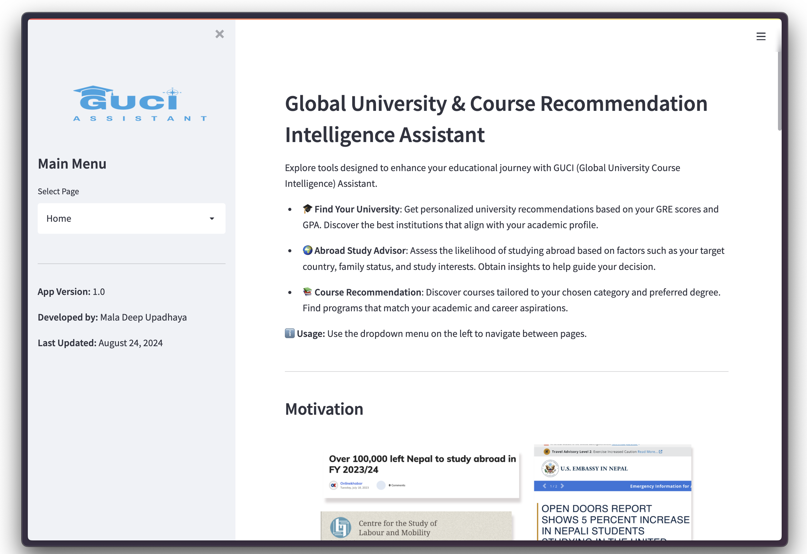
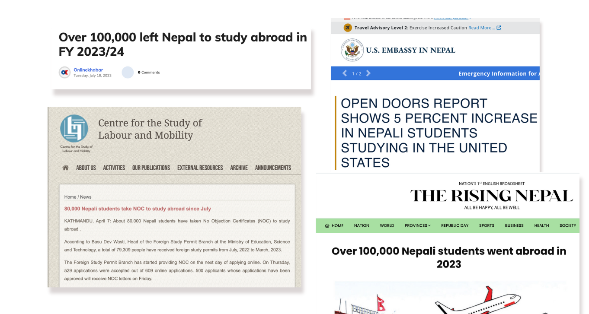
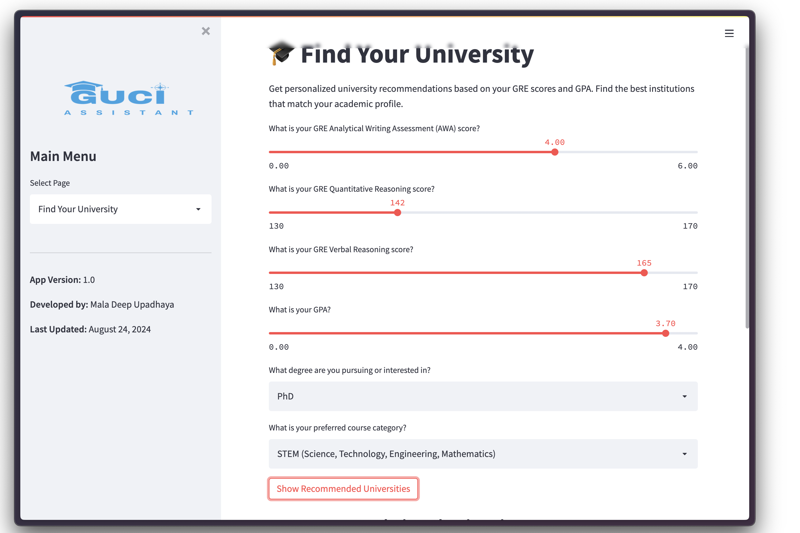
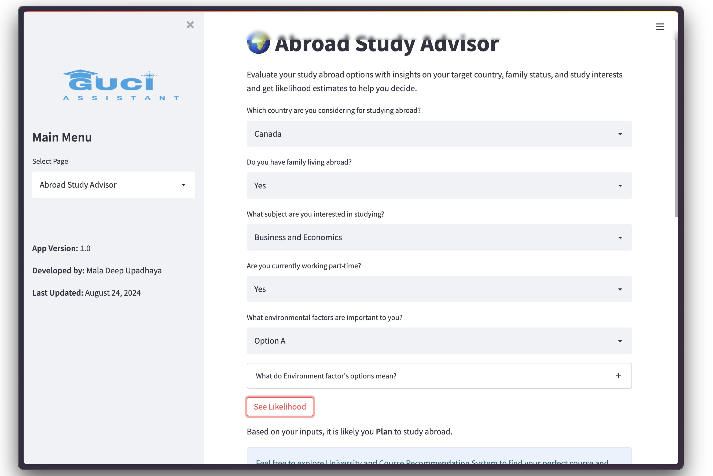

# Global-University-Course-Recommendation-Intelligence-Assistant
Explore tools designed to enhance your educational journey with GUCI (Global University Course Intelligence) Assistant.

## Overview





> For a better experience, please use light mode.
> 
GUCI Assistant offers a suite of features to help you make informed decisions about studying abroad and finding suitable courses and universities. With personalized recommendations and insights, the GUCI Assistant is your go-to tool for navigating academic and career opportunities.

## Features

- **🎓 Find Your University:** Get personalized university recommendations based on your GRE scores and GPA. Discover the best institutions that align with your academic profile.
- **🌍 Abroad Study Advisor:** Assess the likelihood of studying abroad based on factors such as your target country, family status, and study interests. Obtain insights to guide your decision.
- **📚 Course Recommendation:** Discover courses tailored to your chosen category and preferred degree. Find programs that match your academic and career aspirations.

## Project Motivation



A significant number of Nepali individuals are choosing to study or work abroad. This project aims to analyze the factors driving these decisions and develop a data science-based system to support them.

## Project Overview


1. **Survey Design:** Utilizing the Random Utility Framework with Discrete Choice Experiment methodology to gather insights on decision-making processes.
2. **Factor Analysis:** Identifying the key factors influencing Nepali students aged 16 and above in their decision to study or work abroad.
3. **Predictive Modeling:** Developing a machine learning-based system to assess the likelihood of studying abroad based on socio-economic factors.
4. **University and Course Recommendation:** Creating a machine learning system to recommend universities and courses based on GPA and GRE scores.
5. **Course Recommendation:** Designing a machine learning model for course recommendations tailored to degree and subject category preferences.

## 🤖 Machine Learning Workflow


For this project, a survey was conducted using the Random Utility Framework with the Discrete Choice Experiment method. The initial dataset consisted of `(n = 157)` responses. After cleaning, the dataset was refined to `(n = 101)` with 70 features.

### Feature Selection Methods:

1. **Correlation Analysis:** Pearson correlation to identify the most correlated features.
2. **SelectKBest:** Selects features most correlated with the target variable.
3. **Recursive Feature Elimination (RFE):** Features selected based on their importance within a model.
4. **Extremely Randomized Trees:** Insights into features with the greatest predictive power.
5. **Mutual Information:** Captures non-linear relationships between features and the target.
6. **Lasso Regularization:** Prioritizes features by shrinking less important coefficients to zero.

### Machine Learning Model Creation:

Various algorithms were tested:
- Logistic Regression
- K-Nearest Neighbors (KNN)
- Support Vector Machine (SVM)
- Random Forest
- Decision Tree
- Naive Bayes

Techniques for handling class imbalance included:
- **Oversampling:** Random Oversampling, SMOTE, ADASYN
- **Undersampling:** Random Undersampling

Additional processes included scaling, target leakage prevention, hyperparameter optimization, and cross-validation (CV) were also performed.

### Best Model:

Logistic Regression with SMOTE was found to be the best model, achieving a cross-validation accuracy of 89% with optimal parameters: `(C = 1)` and solver = `newton-cg`.

## ℹ️ Recommendation Workflow

The dataset from **[THE World University Rankings 2024](https://www.timeshighereducation.com/world-university-rankings/2024/world-ranking)** (`n=201`, `m=23`) was utilized, along with data from two previous research projects:
- **[Aditya Sureshkumar's University Recommendation System](https://github.com/aditya-sureshkumar/University-Recommendation-System)**
- **[Trama Tejaswini's University Recommendation System](https://github.com/tramatejaswini/University_Recommendation_System)**

Additionally, data for categories and website links of universities were scraped and merged, resulting in 36,894 rows with 40 columns. After cleaning and removing duplicates, only 26,821 rows with 40 columns were retained.

The system was developed using a hybrid recommendation method that combines content-based filtering with collaborative filtering over the ranking data for the best recommendations.

### Recommendation Methods:

1. **Content-Based Recommendation:**
   - **What It Does:** Finds universities and courses that match your preferences.
   - **How It Works:** Compares your GRE scores, GPA, and preferred degree and course to available options.

2. **Fuzzy Matching:**
   - **What It Does:** Matches your chosen universities with ranked institutions.
   - **How It Works:** Searches for the closest matches between your selected universities and a database of ranked universities.

3. **Collaborative Filtering:**
   - **What It Does:** Provides recommendations based on the preferences of similar users.
   - **How It Works:** Analyzes user preferences and behaviors to suggest universities that others with similar profiles have liked.

4. **Scoring System:**
   - **Content Similarity Score:** Shows how well the course matches your input. Higher means a better match. 100 percent is best.
   - **Weighted Score:** Reflects the university’s quality based on teaching, research, and other factors. 100 is best.
   - **Hybrid Score:** Combines content similarity and university quality for the best overall recommendation. 100 is best.

## Getting Started

### Installation

1. Clone the repository:
   ```bash
   git clone https://github.com/maladeep/Global-University-Course-Intelligence.git```
   ```
2. Navigate to the project directory:
 ```bash
  cd Global-University-Course-Intelligence
```
3. Install the required dependencies:
 ``` bash
   pip install -r requirements.txt
   ```

### Usage
Run Streamlit app as:
``` bash
   streamlit run app.py
   ```

### License
This project is licensed under the [Apache License 2.0](https://www.apache.org/licenses/LICENSE-2.0).


# App shot




